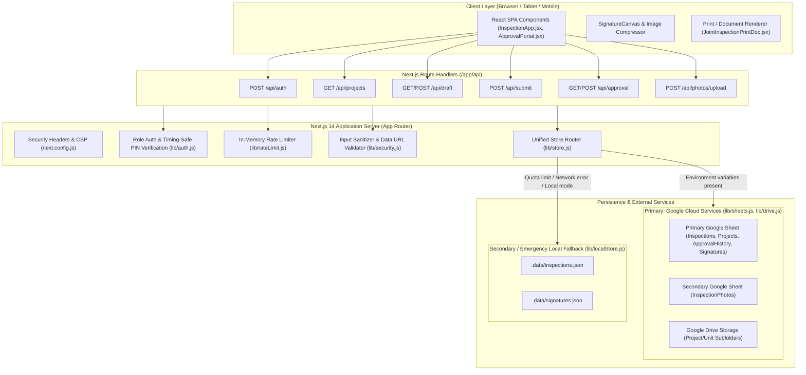

# DAC Joint Inspection & Key Handover — Current Application Architecture

## 1. Executive Summary & Application Overview

The **DAC Joint Inspection & Key Handover Application** is a specialized digital site inspection and multi-role approval workflow system engineered for **DAC Developers**. It digitizes paper-based unit handover checklists for residential apartments/villas, supporting real-time room-by-room defect tagging, digital signature capture, photo attachments, automated PDF/print document generation, and a sequential 7-tier organizational approval chain with parallel signatory gates.

---

## 2. High-Level Architecture Diagram

---

## 3. Core Architectural Patterns

### 3.1 Next.js 14 App Router Hybrid Pattern
- **Client-Side SPA Core**: The user interface is driven primarily by two rich client components: [`components/InspectionApp.jsx`](file:///d:/AUG-2026/dac-inspection-app%20%281%29/components/InspectionApp.jsx) (Site Engineer checklist UI) and [`components/ApprovalPortal.jsx`](file:///d:/AUG-2026/dac-inspection-app%20%281%29/components/ApprovalPortal.jsx) (Management approval queue).
- **Stateless Serverless Route Handlers**: API routes in [`app/api`](file:///d:/AUG-2026/dac-inspection-app%20%281%29/app/api) enforce PIN validation, rate limiting, data sanitization, payload chunking, and storage dispatch without storing session state on the server.

### 3.2 Dual-Tier Hybrid Storage Architecture
The system features a **resilient hybrid storage pattern**:
1. **Primary Backend (Google Workspace API)**:
   - Spreadsheet storage via Google Sheets API v4 ([`lib/sheets.js`](file:///d:/AUG-2026/dac-inspection-app%20%281%29/lib/sheets.js)).
   - Dual-Spreadsheet setup: Main Sheet for structured inspection JSON and approval audit trail, dedicated secondary Sheet (`GOOGLE_PHOTO_SHEET_ID`) for photo logs.
   - File storage via Google Drive API v3 ([`lib/drive.js`](file:///d:/AUG-2026/dac-inspection-app%20%281%29/lib/drive.js)) organized into hierarchy `/Project Name/Unit Number/filename.jpg`.
2. **Emergency Local Fallback Backend**:
   - Atomic filesystem persistence via Node.js `fs` module ([`lib/localStore.js`](file:///d:/AUG-2026/dac-inspection-app%20%281%29/lib/localStore.js)).
   - Data separation: Inspection records stored in `.data/inspections.json`; Base64 signature strings stored separately in `.data/signatures.json` to keep payload size lightweight during queue listings.
   - Failover mechanism in [`lib/store.js`](file:///d:/AUG-2026/dac-inspection-app%20%281%29/lib/store.js) catches Google API failures (429 Quota Exceeded, socket timeouts) and transparently falls back to local storage without losing user data.

---

## 4. Technical Stack Breakdown

| Layer | Technology / Library | Usage & Purpose |
|---|---|---|
| **Framework** | Next.js 14.2.35 (App Router) | Server-side routing, static asset serving, serverless route handlers |
| **UI Library** | React 18.3.1 | Core UI state management, custom components |
| **Styling** | TailwindCSS 3.4.4 + Autoprefixer | Design system, responsive layout, dark blueprint themes |
| **Icons** | Lucide React 0.383.0 | Status icons, navigation, UI controls |
| **Cloud Services** | `googleapis` 176.0.0 | JWT Service Account auth for Google Sheets v4 and Google Drive v3 |
| **Analytics** | `@vercel/analytics` 2.0.1 | Client-side pageview and engagement telemetry |
| **Security & Crypto** | Node.js native `crypto` module | SHA-256 password hashing, timing-safe string comparison |

---

## 5. Performance Optimization & Caching Strategies

1. **In-Memory Server-Side Caching**:
   - `lib/sheets.js` implements a TTL-based memory cache (`cache.projects` with 60s TTL, `cache.inspections` with 30s TTL).
   - Cache invalidation occurs automatically on any `upsertInspection` operation (`invalidateInspectionsCache()`).
2. **Google Sheets String Chunking**:
   - Cell limits in Google Sheets (50,000 chars) are circumvented by splitting inspection JSON payloads across 12 dedicated columns (`DataJSON_1` to `DataJSON_12`, up to ~540,000 characters).
   - Base64 signature payloads are split across 20 dedicated columns (`SigData_1` to `SigData_20`) in the `Signatures` tab.
3. **Heavy Payload Stripping**:
   - List operations (`getAllInspections`) return inspectable markers (`"SIGNED"`) rather than full Base64 signatures to avoid transferring megabytes of image data during queue load.
   - Full Base64 images are re-hydrated on demand only when fetching individual inspection details via `getInspection(id)`.
4. **Client-Side Canvas Image Compression**:
   - Photos captured or selected via `<input type="file">` are scaled to a max width of 700px at JPEG quality 0.5 prior to upload ([`components/InspectionApp.jsx`](file:///d:/AUG-2026/dac-inspection-app%20%281%29/components/InspectionApp.jsx#L107-L127)).
