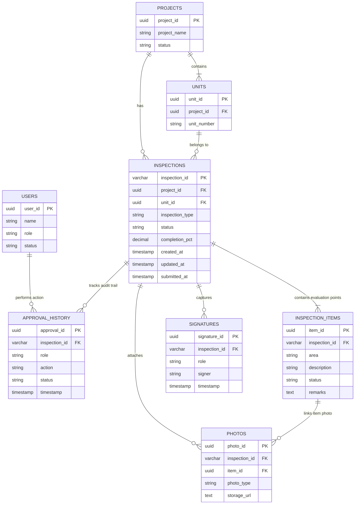

# DAC Joint Inspection & Key Handover — Data Model Specification

## 1. Primary Inspection Data Schema (Legacy Application State)

The `Inspection` object is the core data entity of the application. It represents a complete unit handover checklist record and approval history.

```json
{
  "inspectionId": "DAC-JIC-260827-4821",
  "projectName": "DAC Aspire Heights",
  "unitNumber": "A-101",
  "inspectionType": "INTERIOR JOINT INSPECTION",
  "customerName": "RAGIL IMMANUVEL",
  "customerPhone": "9876543210",
  "customerEmail": "ragil@example.com",
  "inspectionDate": "2026-08-27",
  "inspectionTime": "11:30",
  "interiorDays": "45",
  "siteEngineerName": "Er. Senthil Kumar",
  "generalRemarks": "All electrical points tested. Minor paint touchup requested in bedroom.",
  "declarationChecked": true,
  "status": "submitted",
  "workflowStatus": "QA_QC_PENDING",
  "cells": {
    "1__living": {
      "status": "pass",
      "remarks": "Doors alignment OK",
      "priority": "Low",
      "photos": ["https://drive.google.com/uc?export=view&id=1abc..."]
    },
    "3__living": {
      "status": "fail",
      "remarks": "Scratches on paint near entrance",
      "priority": "High",
      "photos": ["data:image/jpeg;base64,..."]
    }
  },
  "customerVerificationPhoto": "https://drive.google.com/uc?export=view&id=1xyz...",
  "signatures": {
    "customer": "data:image/png;base64,...",
    "siteEngineer": "data:image/png;base64,...",
    "qaqc": "SIGNED",
    "projectManager": "SIGNED"
  },
  "approvalHistory": [
    {
      "id": "550e8400-e29b-41d4-a716-446655440000",
      "inspectionId": "DAC-JIC-260827-4821",
      "project": "DAC Aspire Heights",
      "unit": "A-101",
      "inspectionType": "INTERIOR JOINT INSPECTION",
      "role": "Site Engineer",
      "userName": "Er. Senthil Kumar",
      "action": "Submitted & Approved",
      "status": "QA_QC_PENDING",
      "comments": "Initial inspection completed",
      "timestamp": "27/08/2026 11:35",
      "signature": "Captured"
    }
  ],
  "latestAuditRecord": { ... },
  "rejectionReason": "",
  "rejectedBy": "",
  "rejectedRole": "",
  "updatedAt": "2026-08-27T11:35:00.000Z",
  "submittedAt": "2026-08-27T11:35:00.000Z"
}
```

---

## 2. Entity Attribute Definitions

### 2.1 Inspection Attributes

| Field Name | Type | Allowed Values / Constraints | Description |
|---|---|---|---|
| `inspectionId` | String | Format: `DAC-JIC-YYMMDD-XXXX` | Unique identifier generated upon creation |
| `projectName` | String | Must match active project list | Master project name (e.g. `DAC Aspire Heights`) |
| `unitNumber` | String | Must match active project unit | Target apartment / villa number (e.g. `A-101`) |
| `inspectionType` | String | `INTERIOR JOINT INSPECTION`, `IJI` | Form checklist category |
| `customerName` | String | Max 200 chars | Full name of unit buyer |
| `inspectionDate` | String | `YYYY-MM-DD` | Scheduled inspection date |
| `inspectionTime` | String | `HH:MM` | Scheduled inspection time |
| `interiorDays` | String | Numeric string | Adhered days allowed for customer interior work |
| `status` | String | `draft`, `submitted` | High-level lifecycle state |
| `workflowStatus` | String | See State Machine table below | Current approval stage |
| `declarationChecked`| Boolean | `true`, `false` | Customer legal handover declaration consent |
| `generalRemarks` | String | Max 2000 chars | Overall inspection notes |
| `cells` | Object | Map of `cellKey` -> `Cell` object | Grid status of 11 items × 10 areas |
| `signatures` | Object | Map of `roleSigKey` -> Base64 or `"SIGNED"` | Signature images or markers |
| `approvalHistory` | Array | Array of `AuditRecord` objects | Chronological immutable log of actions |

### 2.2 Room-Item Cell Matrix Entity (`Cell`)

- **Key Format**: `${itemId}__${areaKey}` (e.g., `1__living`, `5__mbed`)
- **Items (11 total)**:
  1. Doors & Windows
  2. Locks and Latches
  3. Wall Painting
  4. Doors & Windows Painting
  5. Tiles – Hall / Toilets / Bedrooms / Kitchens & Balcony
  6. Electrical Fittings
  7. Main Door
  8. Toilet Fittings
  9. Kitchen – Granite Slab / Shelf
  10. Plumbing Lines All Places
  11. Cleaning
- **Areas (10 total)**:
  - `living`, `dining`, `kitchen`, `utility`, `mbed`, `bed2`, `bed3`, `toilets`, `balcony`, `addl`
- **Cell Schema**:
  ```typescript
  interface Cell {
    status: "pass" | "fail" | "na" | null;
    remarks?: string;
    priority?: "Low" | "Medium" | "High";
    photos?: (string | { url?: string; dataUrl?: string })[];
  }
  ```

---

## 3. Workflow State Machine

| `workflowStatus` | Allowed Roles to Act | Next Status on Approve | Next Status on Reject |
|---|---|---|---|
| `DRAFT` | Site Engineer | `QA_QC_PENDING` (via `/api/submit`) | N/A |
| `QA_QC_PENDING` | QA/QC In-Charge | `PROJECT_MANAGER_PENDING` | `REJECTED` |
| `PROJECT_MANAGER_PENDING` | Project Manager | `MANAGER_TECHNICAL_PENDING` | `REJECTED` |
| `MANAGER_TECHNICAL_PENDING` | Manager Technical | `GM_HUG_PENDING` | `REJECTED` |
| `GM_HUG_PENDING` | GM – HUG (Mr. Vijayachandar) | `VP_HUG_PENDING` | `REJECTED` |
| `VP_HUG_PENDING` | VP – HUG (Mrs. Sony Dhiraj) | `COMPLETED` | `REJECTED` |
| `REJECTED` | Site Engineer | `QA_QC_PENDING` (Re-inspection) | N/A |
| `COMPLETED` | Read-only for all roles | None (Final State) | None |

*Note*: Customer (`customer`) and Technical Executive (`technicalExecutive`) sign in parallel during or after initial inspection creation. Advancement past `QA_QC_PENDING` strictly requires **both** `signatures.customer` and `signatures.technicalExecutive` to be present.

---

## 4. Google Sheets Storage Tab Schemas

### 4.1 `Inspections` Tab
- **Columns A to O (Base Headers)**: `InspectionId`, `Project`, `Unit`, `InspectionType`, `CustomerName`, `Date`, `Time`, `Status`, `CompletionPct`, `Passed`, `Failed`, `NA`, `DeclarationChecked`, `UpdatedAt`, `SubmittedAt`
- **Columns P to AA (Data Chunks)**: `DataJSON_1`, `DataJSON_2`, ..., `DataJSON_12` (stores serialized inspection JSON in 45,000 character segments).

### 4.2 `Signatures` Tab
- **Columns A to D (Base Headers)**: `InspectionId`, `Role`, `SignerName`, `Timestamp`
- **Columns E to X (Data Chunks)**: `SigData_1`, `SigData_2`, ..., `SigData_20` (stores raw Base64 PNG image string in 45,000 character segments).

### 4.3 `ApprovalHistory` Tab
- **Columns A to K**: `InspectionID`, `Project`, `Unit`, `InspectionType`, `Role`, `UserName`, `Action`, `Status`, `Comments`, `Timestamp`, `SignatureCaptured`

### 4.4 `Projects` Tab
- **Columns A & B**: `Project`, `Unit` (stores master dropdown list mapping).

### 4.5 `InspectionPhotos` Tab (Secondary Sheet)
- **Columns A to H**: `InspectionID`, `Project`, `Unit`, `PhotoType`, `AreaKey`, `ItemID`, `PhotoURL`, `Timestamp`

---

## 5. Target Normalized Relational Schema (PostgreSQL)

For Phase 2 database modernization, the un-normalized JSON payload and Google Sheets tables are mapped to a fully 3NF compliant PostgreSQL schema.

### 5.1 Entity Relationship Diagram (ERD)



---

### 5.2 PostgreSQL DDL Specification

```sql
-- 1. USERS TABLE
CREATE TABLE users (
    user_id UUID PRIMARY KEY DEFAULT gen_random_uuid(),
    name VARCHAR(200) NOT NULL,
    role VARCHAR(50) NOT NULL, -- e.g., 'SITE_ENGINEER', 'QA_QC', 'PROJECT_MANAGER', 'CUSTOMER'
    status VARCHAR(20) NOT NULL DEFAULT 'ACTIVE', -- 'ACTIVE', 'INACTIVE'
    created_at TIMESTAMPTZ DEFAULT CURRENT_TIMESTAMP
);

-- 2. PROJECTS TABLE
CREATE TABLE projects (
    project_id UUID PRIMARY KEY DEFAULT gen_random_uuid(),
    project_name VARCHAR(200) UNIQUE NOT NULL,
    status VARCHAR(20) NOT NULL DEFAULT 'ACTIVE',
    created_at TIMESTAMPTZ DEFAULT CURRENT_TIMESTAMP
);

-- 3. UNITS TABLE
CREATE TABLE units (
    unit_id UUID PRIMARY KEY DEFAULT gen_random_uuid(),
    project_id UUID NOT NULL REFERENCES projects(project_id) ON DELETE CASCADE,
    unit_number VARCHAR(50) NOT NULL,
    UNIQUE(project_id, unit_number)
);

-- 4. INSPECTIONS TABLE
CREATE TABLE inspections (
    inspection_id VARCHAR(50) PRIMARY KEY, -- e.g. 'DAC-JIC-260827-4821'
    project_id UUID NOT NULL REFERENCES projects(project_id),
    unit_id UUID NOT NULL REFERENCES units(unit_id),
    inspection_type VARCHAR(100) NOT NULL DEFAULT 'INTERIOR JOINT INSPECTION',
    status VARCHAR(50) NOT NULL DEFAULT 'DRAFT', -- 'DRAFT', 'QA_QC_PENDING', 'PROJECT_MANAGER_PENDING', etc.
    completion_pct NUMERIC(5,2) DEFAULT 0.00,
    customer_name VARCHAR(200),
    interior_days INT DEFAULT 45,
    general_remarks TEXT,
    declaration_checked BOOLEAN DEFAULT FALSE,
    rejection_reason TEXT,
    rejected_by VARCHAR(200),
    created_at TIMESTAMPTZ DEFAULT CURRENT_TIMESTAMP,
    updated_at TIMESTAMPTZ DEFAULT CURRENT_TIMESTAMP,
    submitted_at TIMESTAMPTZ
);

-- 5. INSPECTION_ITEMS TABLE (Evaluated Matrix Cells)
CREATE TABLE inspection_items (
    item_id UUID PRIMARY KEY DEFAULT gen_random_uuid(),
    inspection_id VARCHAR(50) NOT NULL REFERENCES inspections(inspection_id) ON DELETE CASCADE,
    area VARCHAR(50) NOT NULL, -- e.g., 'living', 'kitchen', 'mbed'
    description VARCHAR(255) NOT NULL, -- e.g., 'Doors & Windows', 'Electrical Fittings'
    status VARCHAR(20) NOT NULL CHECK (status IN ('pass', 'fail', 'na')),
    remarks TEXT,
    priority VARCHAR(20) CHECK (priority IN ('Low', 'Medium', 'High')),
    UNIQUE(inspection_id, area, description)
);

-- 6. PHOTOS TABLE
CREATE TABLE photos (
    photo_id UUID PRIMARY KEY DEFAULT gen_random_uuid(),
    inspection_id VARCHAR(50) NOT NULL REFERENCES inspections(inspection_id) ON DELETE CASCADE,
    item_id UUID REFERENCES inspection_items(item_id) ON DELETE SET NULL,
    photo_type VARCHAR(50) NOT NULL, -- 'customerVerification', 'fail', 'pass'
    storage_url TEXT NOT NULL, -- Google Drive URL or S3 URL
    created_at TIMESTAMPTZ DEFAULT CURRENT_TIMESTAMP
);

-- 7. SIGNATURES TABLE
CREATE TABLE signatures (
    signature_id UUID PRIMARY KEY DEFAULT gen_random_uuid(),
    inspection_id VARCHAR(50) NOT NULL REFERENCES inspections(inspection_id) ON DELETE CASCADE,
    role VARCHAR(50) NOT NULL, -- 'customer', 'siteEngineer', 'qaqc', 'projectManager', etc.
    signer VARCHAR(200) NOT NULL,
    storage_url TEXT, -- Base64 or cloud image URL
    timestamp TIMESTAMPTZ DEFAULT CURRENT_TIMESTAMP,
    UNIQUE(inspection_id, role)
);

-- 8. APPROVAL_HISTORY TABLE
CREATE TABLE approval_history (
    approval_id UUID PRIMARY KEY DEFAULT gen_random_uuid(),
    inspection_id VARCHAR(50) NOT NULL REFERENCES inspections(inspection_id) ON DELETE CASCADE,
    user_id UUID REFERENCES users(user_id) ON DELETE SET NULL,
    role VARCHAR(50) NOT NULL,
    action VARCHAR(50) NOT NULL, -- 'Submitted', 'Approved', 'Rejected', 'Signed'
    status VARCHAR(50) NOT NULL, -- Resulting workflow status
    comments TEXT,
    timestamp TIMESTAMPTZ DEFAULT CURRENT_TIMESTAMP
);

-- Performance Indexing
CREATE INDEX idx_inspections_project_unit ON inspections(project_id, unit_id);
CREATE INDEX idx_inspections_status ON inspections(status);
CREATE INDEX idx_inspection_items_lookup ON inspection_items(inspection_id, area);
CREATE INDEX idx_approval_history_inspection ON approval_history(inspection_id);
```
