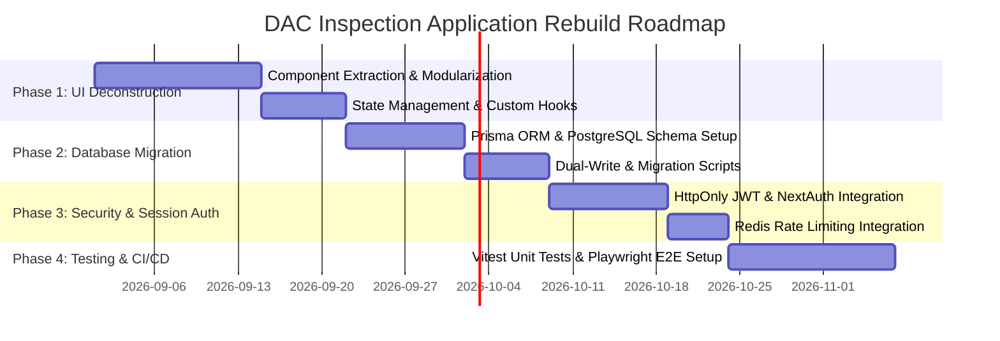

# DAC Joint Inspection & Key Handover — Comprehensive Rebuild & Modernization Plan

This document synthesizes code audit findings, technical debt, duplicate code patterns, and test coverage gaps into an actionable, multi-phase refactoring roadmap for upgrading the codebase to enterprise standards.

---

## 1. Technical Debt & Code Smell Audit

### 1.1 UI Component Monoliths
- **[`components/InspectionApp.jsx`](file:///d:/AUG-2026/dac-inspection-app%20%281%29/components/InspectionApp.jsx)** (2,398 lines, ~120 KB):
  - **Issue**: Combines Site Engineer login hero, project/unit selection, full 11×10 checklist rendering, image compression canvas, digital signature modals, Toast stack state, inspection summary metrics, local draft persistence, and print triggering into a single monolithic component file.
  - **Impact**: Extremely difficult to maintain, high risk of regression when modifying single features, suboptimal bundle size.
- **[`components/ApprovalPortal.jsx`](file:///d:/AUG-2026/dac-inspection-app%20%281%29/components/ApprovalPortal.jsx)** (1,554 lines, ~71 KB):
  - **Issue**: Contains approval queue filtering, 7-role login modals, multi-step approve/reject dialogs, search indexing, print preview modals, and state machine calculations in one file.

### 1.2 Database Workaround & Payload Hacking
- **Google Sheets String Chunking**:
  - Google Sheets limits individual cell string length to 50,000 characters. To store large inspection JSON payloads and Base64 signatures, [`lib/sheets.js`](file:///d:/AUG-2026/dac-inspection-app%20%281%29/lib/sheets.js) forcibly splits strings across 12 data columns (`DataJSON_1`..`12`) and 20 signature columns (`SigData_1`..`20`).
  - **Impact**: Fragile, slow query execution, high risk of payload truncation if inspections grow large, severe API rate limiting under concurrent load.

### 1.3 Duplicate Code Inventory

| Duplicated Logic / Pattern | Source Locations | Proposed Refactored Module |
|---|---|---|
| `computeStats(data)` | [`lib/sheets.js:315`](file:///d:/AUG-2026/dac-inspection-app%20%281%29/lib/sheets.js#L315), [`lib/localStore.js:56`](file:///d:/AUG-2026/dac-inspection-app%20%281%29/lib/localStore.js#L56), [`lib/store.js:87`](file:///d:/AUG-2026/dac-inspection-app%20%281%29/lib/store.js#L87) | Shared utility `lib/utils/inspectionStats.js` |
| `formatPrivateKey(key)` | [`lib/sheets.js:105`](file:///d:/AUG-2026/dac-inspection-app%20%281%29/lib/sheets.js#L105), [`lib/drive.js:21`](file:///d:/AUG-2026/dac-inspection-app%20%281%29/lib/drive.js#L21) | Shared utility `lib/utils/cryptoUtils.js` |
| `chunkString(str)` | [`lib/sheets.js:178`](file:///d:/AUG-2026/dac-inspection-app%20%281%29/lib/sheets.js#L178) (duplicated internally for signatures & data) | Shared helper in `lib/sheets.js` |
| Role Configuration Objects | [`lib/auth.js:4-85`](file:///d:/AUG-2026/dac-inspection-app%20%281%29/lib/auth.js#L4-L85), [`components/ApprovalPortal.jsx:14-24`](file:///d:/AUG-2026/dac-inspection-app%20%281%29/components/ApprovalPortal.jsx#L14-L24), [`scratch/full_workflow_test.mjs:30-40`](file:///d:/AUG-2026/dac-inspection-app%20%281%29/scratch/full_workflow_test.mjs#L30-L40) | Centralized constant `lib/constants/roles.js` |
| Master Project Seed Data | [`lib/localStore.js:9-13`](file:///d:/AUG-2026/dac-inspection-app%20%281%29/lib/localStore.js#L9-L13), [`app/api/projects/route.js:14-18`](file:///d:/AUG-2026/dac-inspection-app%20%281%29/app/api/projects/route.js#L14-L18), [`components/InspectionApp.jsx:20-24`](file:///d:/AUG-2026/dac-inspection-app%20%281%29/components/InspectionApp.jsx#L20-L24) | Centralized constant `lib/constants/projects.js` |

---

## 2. Test Coverage Analysis

### Current State
- **Automated Test Suite**: No Jest, Vitest, or Playwright configuration in `package.json`.
- **Manual / Scratch Scripts**:
  - `api-test.mjs`: Node.js script testing API endpoints against a live local dev server (`http://localhost:3000`).
  - `scratch/full_workflow_test.mjs`: Direct node execution testing internal `lib` module functions.
  - Various ad-hoc root scripts (`test-sheets.js`, `test-api-projects.js`, `check-and-patch-columns.js`).
- **Test Coverage Estimate**: < 5% automated coverage. Key workflows (canvas signature drawing, print rendering, error boundary catching) lack automated integration tests.

---

## 3. Four-Phase Rebuild & Modernization Plan

### Phase 1: UI Component Deconstruction & Modularization
1. Break down [`components/InspectionApp.jsx`](file:///d:/AUG-2026/dac-inspection-app%20%281%29/components/InspectionApp.jsx) into focused components:
   - `components/inspection/HeroLoginBanner.jsx`
   - `components/inspection/ProjectSelector.jsx`
   - `components/inspection/ChecklistGrid.jsx`
   - `components/inspection/CellDetailModal.jsx`
   - `components/inspection/SignatureCaptureModal.jsx`
   - `components/ui/ToastProvider.jsx`
2. Break down [`components/ApprovalPortal.jsx`](file:///d:/AUG-2026/dac-inspection-app%20%281%29/components/ApprovalPortal.jsx) into:
   - `components/approval/ApprovalQueueTable.jsx`
   - `components/approval/RoleAuthModal.jsx`
   - `components/approval/ApprovalActionModal.jsx`
3. Extract custom hooks:
   - `hooks/useInspectionData.js`
   - `hooks/useApprovalQueue.js`
   - `hooks/useSignatureCanvas.js`

### Phase 2: Database Tier Modernization (Replace Google Sheets Hack)
1. Introduce **PostgreSQL** (via Supabase or Neon) with **Prisma ORM**.
2. Provision 8 normalized relational tables (detailed in [`/docs/DATA_MODEL.md`](file:///d:/AUG-2026/dac-inspection-app%20%281%29/docs/DATA_MODEL.md)):
   - `USERS` (`user_id`, `name`, `role`, `status`)
   - `PROJECTS` (`project_id`, `project_name`, `status`)
   - `UNITS` (`unit_id`, `project_id`, `unit_number`)
   - `INSPECTIONS` (`inspection_id`, `project_id`, `unit_id`, `inspection_type`, `status`, `completion_pct`, `created_at`, `updated_at`, `submitted_at`)
   - `INSPECTION_ITEMS` (`item_id`, `inspection_id`, `area`, `description`, `status`, `remarks`)
   - `PHOTOS` (`photo_id`, `inspection_id`, `item_id`, `photo_type`, `storage_url`)
   - `SIGNATURES` (`signature_id`, `inspection_id`, `role`, `signer`, `timestamp`)
   - `APPROVAL_HISTORY` (`approval_id`, `inspection_id`, `role`, `action`, `status`, `timestamp`)
3. Replace `lib/sheets.js` chunking hacks with standard indexed SQL queries.
4. Maintain Google Sheets export feature as an async background reporting job rather than primary storage.

### Phase 3: Enterprise Authentication & Distributed Rate Limiting
1. Replace 6-digit PIN payload passing with **NextAuth / Jose JWT** issuing secure `HttpOnly`, `SameSite=Strict` cookies upon login.
2. Implement **Upstash Redis** rate limiter in `lib/rateLimit.js` for distributed serverless enforcement.
3. Add role-based middleware (`middleware.js`) to protect `/api/submit` and `/api/approval` routes automatically at the edge.

### Phase 4: Automated Testing Suite & CI/CD Pipeline
1. Install **Vitest** for unit testing core logic (`lib/auth.js`, `lib/security.js`, `computeStats`).
2. Install **Playwright** for end-to-end user flow verification:
   - E2E Test 1: Complete Site Engineer inspection creation, checklist tagging, signature capture, and submission.
   - E2E Test 2: Sequential management approval chain from QA/QC down to VP – HUG.
   - E2E Test 3: Rejection flow and Site Engineer re-inspection loop.
3. Configure GitHub Actions workflow (`.github/workflows/ci.yml`) to execute linting, type-checking, and test suite on every pull request.
